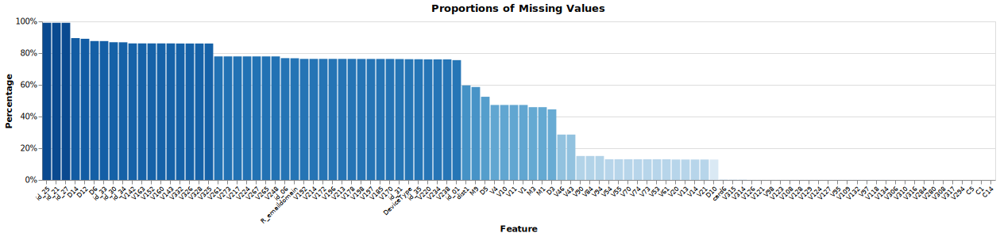
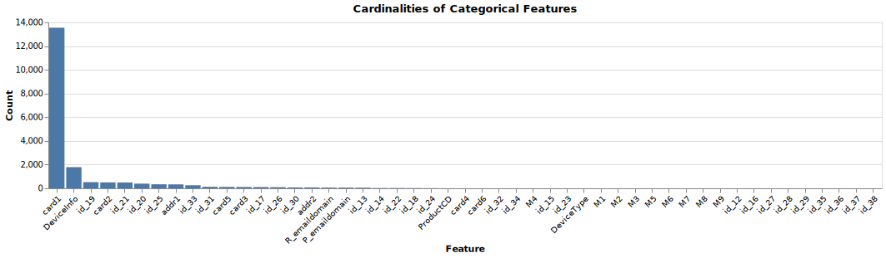
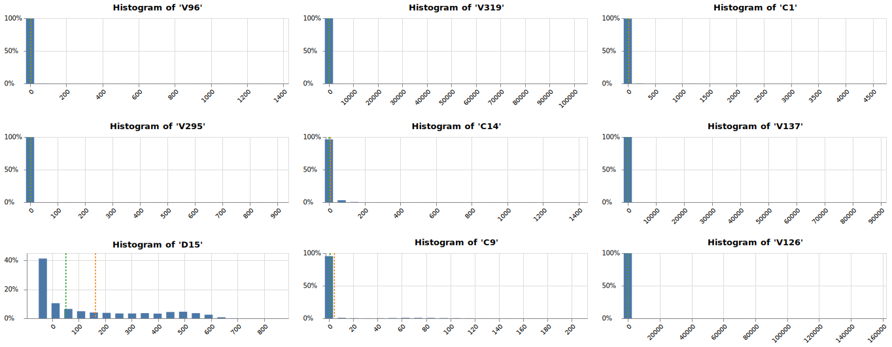

# IEEE-CIS Fraud Detection with Unsupervised Learning
## Goals
* The prediction performances and computation times of various **unsupervised learning anomaly detection** algorithms such as **Isolation Forest**, **COPOD**, and **Random Cut Forest**, are compared.
* (Optional) `Altair` is applied for the purpose of drawing interactive plots during EDA.
  
## Requirement
* The dataset can be downloaded from [this Kaggle competition](https://www.kaggle.com/c/ieee-fraud-detection/).
* `Altair`, `vega-datasets`, `PyOD` and `scikit-learn` version 0.24 libraries are required. 
* For some experiments, `Amazon SageMaker` and related SDKs are needed. This installation can be skipped.
  
## EDA
To preprocess data for modeling, I quickly explored proportions of missing values, cardinalities of categorical features, distributions of numerical features, and a correlation coefficient matrix. For the efficiency of the calculation, I selected 100 features by random sampling and looked at the proportions of their missing values. I have found that most of the features have a fairly high percentage of missing values.
  

  
A list and description of categorical features can be found on [this Kaggle page](https://www.kaggle.com/c/ieee-fraud-detection/data). Some categorical features have more than a few hundred categories, or even more than 10,000.

  
In order to examine the distribution of numerical features, some of the features with few missing values and adequately distributed were randomly selected. From the histograms, it can be seen that most of the features have a long tail.

  
  
Finally I calculated the correlation coefficient matrix. While most of the features are not correlated, some have very high positive correlations.

## Data Splitting & Preprocessing
In the general case of unsupervised learning, it is not possible to evaluate the predictive performance, but since there are labels in this example, 20% of the total was splitted into the validation dataset. Ordinal Encoding and imputation were applied to categorical features, and imputation was applied after normalization to numeric features. To view the transformed validation dataset, the dimensions of the dataset was reduced using **t-SNE**. The manifold looks like a twisted band, and the fraudulent labels appear to exist outside the clusters. Therefore, it seems that pretty good accuracy can be achieved even with unsupervised learning.
  

## Modeling with Isolation Forest, Random Cut Forest and COPOD
I used popular tree ensemble models, namely **Isolation Forest** and **Random Cut Forest**, and the latest algorithm **Copula-based Outlier Detection**(COPOD). For a detailed description of the algorithms, refer to the following links.
* [Liu, Fei Tony, Ting, Kai Ming and Zhou, Zhi-Hua. “Isolation forest.” Data Mining, 2008. ICDM’08. Eighth IEEE International Conference on.](https://cs.nju.edu.cn/zhouzh/zhouzh.files/publication/icdm08b.pdf?q=isolation-forest)
* [Liu, Fei Tony, Ting, Kai Ming and Zhou, Zhi-Hua. “Isolation-based anomaly detection.” ACM Transactions on Knowledge Discovery from Data (TKDD) 6.1 (2012): 3.](https://cs.nju.edu.cn/zhouzh/zhouzh.files/publication/tkdd11.pdf)
* [Sudipto Guha, Nina Mishra, Gourav Roy, and Okke Schrijvers. "Robust random cut forest based anomaly detection on streams." In International Conference on Machine Learning, pp. 2712-2721. 2016. ](http://proceedings.mlr.press/v48/guha16.pdf)
* [Li, Z., Zhao, Y., Botta, N., Ionescu, C. and Hu, X. COPOD: Copula-Based Outlier Detection. IEEE International Conference on Data Mining (ICDM), 2020.](https://arxiv.org/pdf/2009.09463.pdf)
  
Isolation Forest fitting used 12 cores as multi-threading, but COPOD was fitted with a single thread. Random Cut Forest was trained using AWS EC2 `ml.m4.xlarge` instance.

## Model Evaluation
Anomaly scores output by the models have log-normal distributions with long tails as expected.
  

  
**COPOD is the highest for both AUROC and AUPRC, followed by Isolation Forest, followed by Random Cut Forest.**
  

  

  
The results are summarized in a table as follows.
  
|Detector|AUROC|AUPRC|Training Time|Spec.|
|:------:|:---:|:---:|:---:|:---:|
|COPOD|77.55%|15.33%|4min 48s|MacBook Pro (16 CPUs, mem 32GB)|
|Isolation Forest|76.33%|13.74%|5min 23s|MacBook Pro (16 CPUs, mem 32GB)|
|Random Cut Forest|68.84%|7.96%|3min 10s|EC2 ml.m4.xlarge (2 CPUs, mem 16GB)|

## Submission
COPOD performance was the best in AUROC, the competition criterion, so I fitted the entire dataset with it and submitted the predictions. The final result is AUROC 82.03%, which is quite far from 94.59%, which is No. 1 in the private leaderboard, but the possibility as unsupervised learning could be found.
