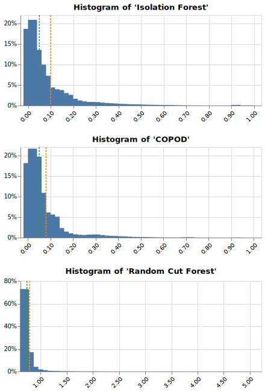

# IEEE-CIS Fraud Detection with Unsupervised Learning
### Goals
* Compare the prediction performances and computation times of various unsupervised learning anomaly detection algorithms such as *Isolation Forest*, *COPOD*, and *Random Cut Forest*.
* (Optional) Use `Altair` for the purpose of drawing interactive plots during EDA.
  
### Requirements
* The dataset can be downloaded from [this Kaggle competition](https://www.kaggle.com/c/ieee-fraud-detection).
* In addition to the [Anaconda](https://www.anaconda.com) libraries, you need to install `altair`, `vega_datasets`, `category_encoders`, `pyod` and `scikit-learn` version 0.24 or higher.
* You also need to set up an AWS account and install `awscli` and `sagemaker-python-sdk`.
  
## Exploratory Data Analysis
To preprocess data for modeling, I quickly explored proportions of missing values, cardinalities of categorical features, distributions of numerical features, and a correlation coefficient matrix. For the efficiency of the calculation, I selected some features by random sampling and looked at the proportions of their missing values. I have found that most of the features have a fairly high percentage of missing values.
  

  
A list and description of categorical features can be found on [this Kaggle page](https://www.kaggle.com/c/ieee-fraud-detection/data). Some categorical features have more than a few hundred categories, or even more than 10K.

  
In order to examine the distribution of numerical features, I randomly selected some features. From the histograms, it can be seen that most of the features have a long tail.

  
  
Finally, I calculated the correlation coefficient matrix. While most of the features are not correlated, some have very high positive correlations.

## Data Splitting and Preprocessing
In the general case of unsupervised learning, it is not possible to evaluate the predictive performance. However, since there are labels in this example, I split 20% of the total into the validation dataset. I preprocessed using ordinal encoding, missing value imputation, and *Helmert Encoding* for categorical features, and applied missing value imputation to numeric features. Then I normalized all the features.
  
### Data Visualization with t-SNE 
To view the transformed validation dataset, I reduced the dimensions of the dataset using *t-SNE*. The manifold looks like a few clusters, and the fraudulent labels appear to exist outside the clusters. Therefore, it seems that pretty good accuracy can be achieved even with unsupervised learning.
  

## Model Training and Prediction
### Fitting and Prediction with Isolation Forest, Random Cut Forest and COPOD
I used popular tree ensemble models, namely *Isolation Forest* and *Random Cut Forest*, and the latest algorithm *Copula-based Outlier Detection*(COPOD). For detailed explanations and usages of the algorithms, please refer to the following link.
* [Liu, Fei Tony, Ting, Kai Ming and Zhou, Zhi-Hua. “Isolation forest.” Data Mining, 2008. ICDM’08. Eighth IEEE International Conference on.](https://cs.nju.edu.cn/zhouzh/zhouzh.files/publication/icdm08b.pdf?q=isolation-forest)
* [Liu, Fei Tony, Ting, Kai Ming and Zhou, Zhi-Hua. “Isolation-based anomaly detection.” ACM Transactions on Knowledge Discovery from Data (TKDD) 6.1 (2012): 3.](https://cs.nju.edu.cn/zhouzh/zhouzh.files/publication/tkdd11.pdf)
* [Sudipto Guha, Nina Mishra, Gourav Roy, and Okke Schrijvers. "Robust random cut forest based anomaly detection on streams." In International Conference on Machine Learning, pp. 2712-2721. 2016. ](http://proceedings.mlr.press/v48/guha16.pdf)
* [Li, Z., Zhao, Y., Botta, N., Ionescu, C. and Hu, X. COPOD: Copula-Based Outlier Detection. IEEE International Conference on Data Mining (ICDM), 2020.](https://arxiv.org/pdf/2009.09463.pdf)
* [Python Outlier Detection (PyOD)](https://pyod.readthedocs.io/en/latest)
* [SageMaker Python SDK: Random Cut Forest](https://sagemaker.readthedocs.io/en/stable/algorithms/randomcutforest.html)
  
*Isolation Forest* fitting used 12 cores as multi-threading, but *COPOD* was fitted with a single thread. I used an AWS EC2 instance, `ml.m4.xlarge` to train SageMaker's **First Party Algorithm Estimator**, *Random Cut Forest*.

## Model Evaluation
Anomaly scores output by the models have log-normal distributions with long tails as expected.
  

  
*COPOD* is the highest for both AUROC and AUPRC, followed by *Isolation Forest*, followed by *Random Cut Forest*.
  

  

  
The results are summarized in a table as follows.
  
|Estimator|AUROC|AUPRC|Training Time|Spec.|
|:------:|:---:|:---:|:---:|:---:|
|COPOD|77.55%|15.53%|5min 12s|MacBook Pro (16 CPUs, mem 32GB)|
|Isolation Forest|76.33%|13.74%|6min 20s|MacBook Pro (16 CPUs, mem 32GB)|
|Random Cut Forest|74.22%|12.71%|3min 38s|EC2 ml.m4.xlarge (2 CPUs, mem 16GB)|

### Conclusion
*COPOD* performance was the best in AUROC, the competition criterion, so I fitted the entire dataset with it and submitted the predictions. The final result is AUROC 77.26%, which is quite far from 94.59%, which is No. 1 in the private leaderboard, but the possibility as unsupervised learning could be found.
